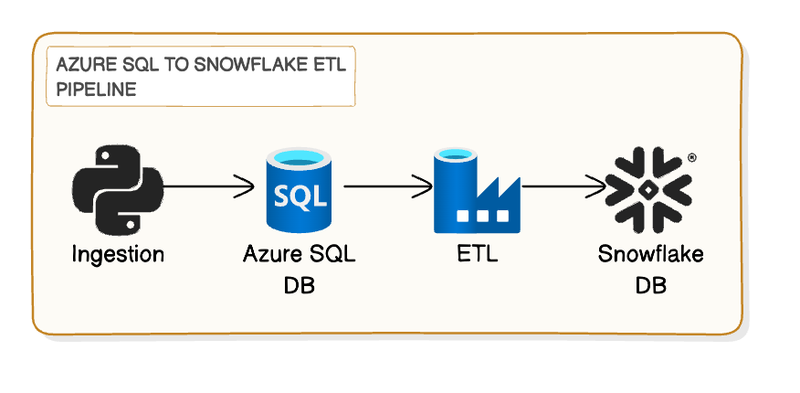

Here's a structured README template for your project:

# Data Engineering Project: Azure SQL to Snowflake ETL Pipeline

## Table of Contents

1. [Project Overview](#project-overview)
2. [Architecture](#architecture)
3. [Prerequisites](#prerequisites)
4. [Setup Instructions](#setup-instructions)
   - [Step 1: Set Up Azure Resources](#step-1-set-up-azure-resources)
   - [Step 2: Deploy ARM Template](#step-2-deploy-arm-template)
   - [Step 3: Configure Azure Data Factory](#step-3-configure-azure-data-factory)
5. [Creating Data Factory Pipelines](#creating-data-factory-pipelines)
6. [Guidelines for Data Modeling and Transformation](#guidelines-for-data-modeling-and-transformation)
7. [Conclusion](#conclusion)

## Project Overview

This project demonstrates a data engineering workflow that involves uploading data from JSON files to an Azure SQL Database, performing transformations and filtering using Azure Data Factory, and exporting the processed data to a Snowflake database.

## Architecture



The architecture consists of the following components:

1. **Azure SQL Database**: Stores the initial data uploaded from JSON files.
2. **Azure Data Factory**: Performs data transformation and filtering.
3. **Snowflake Database**: Stores the final processed data.

## Prerequisites

Before you begin, ensure you have the following:

- An Azure account with necessary permissions.
- A Snowflake account with necessary permissions.
- Azure CLI installed on your local machine.
- Python installed on your local machine.
- Required Python packages: `psycopg2-binary`, `pandas`, `snowflake-connector-python`.

## Setup Instructions

### Step 1: Set Up Azure Resources

1. **Create an Azure Resource Group**
   ```bash
   az group create --name yourResourceGroup --location yourLocation
   ```

2. **Create an Azure SQL Database**
   - Navigate to the Azure portal.
   - Create an Azure SQL Database following the instructions provided in the portal.

### Step 2: Deploy ARM Template

1. **Save the ARM Template**
   - Save the ARM template provided above as `azure-deploy.json`.

2. **Deploy the ARM Template**
   ```bash
   az deployment group create --resource-group yourResourceGroup --template-file azure-deploy.json --parameters \
     sqlServerName=your-sql-server \
     sqlServerAdminLogin=sqladmin \
     sqlServerAdminPassword=yourPassword123 \
     sqlDatabaseName=your-sql-database \
     dataFactoryName=your-data-factory \
     snowflakeAccount=your-snowflake-account \
     snowflakeUser=your-snowflake-user \
     snowflakePassword=yourSnowflakePassword123 \
     snowflakeDatabase=your-snowflake-database \
     snowflakeWarehouse=your-snowflake-warehouse
   ```

### Step 3: Configure Azure Data Factory

1. **Create Linked Services**
   - Create linked services for your Azure SQL Database and Snowflake in Azure Data Factory.

2. **Create Datasets**
   - Create datasets corresponding to your Azure SQL Database tables and Snowflake tables.

## Creating Data Factory Pipelines

### Step 1: Create a Pipeline

1. Go to the Azure Data Factory portal.
2. Click on the "Author" icon and then on "Pipelines".
3. Click on "New pipeline".

### Step 2: Add Activities

1. **Add a Copy Data Activity**
   - Drag a "Copy Data" activity to the pipeline canvas.
   - Configure the source to be your Azure SQL Database dataset.
   - Configure the sink to be your Snowflake dataset.

2. **Add Data Flow Activities**
   - Use data flow activities to perform necessary transformations and filtering.
   - Configure the transformations as per your data modeling requirements.

### Step 3: Schedule and Monitor the Pipeline

1. **Add a Trigger**
   - Add a trigger to schedule the pipeline execution at desired intervals.

2. **Monitor the Pipeline**
   - Use the monitoring tools in Azure Data Factory to track pipeline execution and debug any issues.

## Guidelines for Data Modeling and Transformation

- **Data Modeling**: Define the schema and structure of your data in Azure SQL Database and Snowflake.
- **Data Transformation**: Implement necessary transformations using data flow activities in Azure Data Factory.
  - Examples include filtering rows, adding computed columns, joining tables, etc.

## Conclusion

This README provides a framework to set up a data engineering pipeline using Azure SQL Database, Azure Data Factory, and Snowflake. Follow the steps to recreate the project, and refer to the guidelines for data modeling and transformation to customize the pipeline as per your requirements. For detailed instructions on data modeling and transformation, please refer to the relevant documentation and best practices.

---

Feel free to modify this README to fit your specific needs and include any additional details or diagrams that may be helpful for understanding the project.